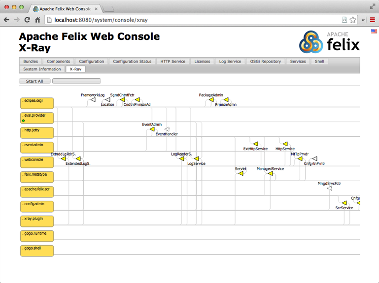

# Overview 

{: .thumb200-l }

In this tutorial we develop a little project that creates a simple server application that interacts with an OSGi console shell. 

A disclaimer. This tutorial is about learning to use OSGi enRoute, not about learning Java, Git, nor Eclipse. It is assumed that you have basic experience with these tools.

If you have any questions about this tutorial, please discuss them in the [forum][forum] (TODO: Mailinglist/Github Issues?).

{: style='clear:both;' }

## Sections

1. [Prerequisites](prerequisites.html) – The prerequisites for the use of OSGi enRoute (Important!)
1. [The Workspace](workspace.html) – Create and manage a bnd workspace
1. [API Project](api.html) – How to work with bnd projects properly, API based design.
1. [Provider Project](provider.html) – Create a project that provides an implementation of the Eval service.
1. [Testing the Provider with (Standard) JUnit](junit.html) – Test the Provider project with a standard (non-OSGi) JUnit test
1. [Running Your Code](run.html) – How to run your code in a framework
1. [Debugging](debug.html) – How to debug a running framework
1. [Dependencies](dependencies.html) – Handling external dependencies (or where is Maven Central)
1. [Testing in OSGi](testing.html) – Executing JUnit tests in a running OSGi framework
1. [Deploying an Application](deploy.html) – Creating a sample application and deploying it.
1. [Continuous Integration](ci.html) – How to setup a Git project and run a Continuous Integration server

## End

So, you've finished this tutorial! What's next?

Well, first, since we're still in beta, we'd love feedback. Our most favorite feedback is a pull request on the documentation. As an early user you must have run into some rough edges, outright stupidities, or you had a brilliant idea. Just go to the [OSGi enRoute][enroute-doc] repository on Github. Clone it in your own account, make your changes or additions, and send a pull request. We, and others like you, highly appreciate these kind of contributions.

After you've done this tutorial you should have a basic feeling of how to build an application with  OSGi enRoute. So the best way to continue learning is to build a small application based on these principles. Running into real problems is the best way to learn a technology. If you run into problems, use the [Forum][forum] to ask questions and get answers.

And watch this space, we will expand this site with hundreds of data sheets of services you can find on the net. These data-sheets will show you how to use this service in your application with real examples. 

  

[forum]: /forum.html
[enroute-doc]: https://github.com/osgi/osgi.enroute.site

