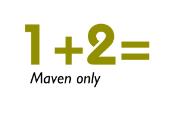
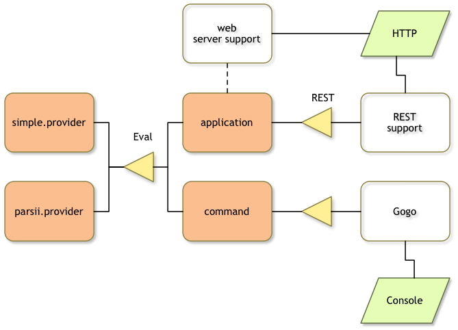

# Overview

{: .thumb200-l }

This tutorial shows you how to build an OSGi enRoute
executable JAR using Maven and vi only. This tutorial will be purely command-line based. (There is one
section outlining how M2E and the Bndtools editors can be useful, even for pure command line
aficionados.)

What we will build is a similar application that is developed in the [Base Tutorial] but instead of Bndtools we use Maven. 

This application is a trivial Web application. It provides a text input box and an `Eval` button. The
text is sent to the server for evaluation. There a service is used to evaluate the input. We'll
turn the application into an executable JAR that contains all its dependencies.

The tutorial will only use plain Maven and vi. You can of course use your own favorite
editor to edit the pom and bnd files.

The result of this tutorial can be found on Github at 
[https://github.com/osgi/osgi.enroute.examples.eval](https://github.com/osgi/osgi.enroute.examples.eval).

A disclaimer. This tutorial is about learning to use Maven to build an OSGi enRoute 
executable JAR, it is not about learning vi, Java, Git, nor Maven or M2Eclipse. 

And as always, [pull requests][osgi.enroute.site] are highly appreciated.

## What We Will Build

This tutorial will build the following application:

{: width=50%}

You can find more about this form of documenting in the [About OSGi](http://enroute.osgi.org/doc/100-about-osgi) section

## Where

You should create a directory somewhere in your file system, let's say `~/workspaces/osgi.enroute.examples.eval`.
We are going to assume this is your default directory for your shell.

	$ mkdir ~/workspaces/osgi.enroute.examples.eval
	$ cd ~/workspaces/osgi.enroute.examples.eval
{: .shell }

## Sections

1. [Parent Pom](parent) – Create a Maven parent pom project
1. [API Project](api) – How to work with bnd projects properly, API based design.
1. [Provider Bundle Project](provider) – Create a project that provides an implementation of the Eval service.
1. [Testing our Provider](provider-junit) – Create and run JUnit tests for our provider bundle
1. [OSGi Runtime](run) – How to create an OSGi Runtime
1. [Command Project](command) – Create a shell command that exercises the evaluation parser
1. [Dependencies](dependencies) – Use a standard parser instead of our simplistic parser
1. [A Web Application](web) – Create a one page web app that uses our evaluator
1. [Integration Testing](testing) – Run integration tests
1. [Modules](modules) – Turning the parent pom into a module pom
1. [Continuous Integration](ci) – Build the modules in continuous integration
1. [Eclipse and Bndtools](eclipse) – Use Eclipse to edit debug your bundles with the Bndtools editors

## End

So, you've finished this tutorial! What's next?

We'd love some feedback. Our most favorite feedback is a pull request on the documentation. 
As an early user you must have run into some rough edges, outright stupidities, or you had 
a brilliant idea. Just go to the [OSGi enRoute][osgi.enroute.site] repository on Github. 
Clone it in your own account, make your changes or additions, and send a pull request. 
We, and others like you, highly appreciate these kind of contributions.

After you've done this tutorial you should have a basic feeling of how to build an 
application using Distributed OSGi with  OSGi enRoute. So the best way to continue 
learning is to build a small application based on these principles. Running into 
real problems is the best way to learn a technology. If you run into problems, use 
the [Forum][forum] to ask questions and get answers.

And watch this space, we will expand this site with many data sheets of 
services you can find on the net. These data-sheets will show you how to 
use this service in your application with real examples.

[forum]: /forum.html
[osgi.enroute.site]: https://github.com/osgi/osgi.enroute.site
[Quick Start Tutorial]: /qs/050-start
[Base Tutorial]: /tutorial_base/05_start
[M2Eclipse]: http://www.eclipse.org/m2e/
[Bndtools]: http://bndtools.org/ 

[parent]: parent.html
[api]: api.html
[provider]: provider.html
[provider-junit]: provider-junit.html
[run]: run.html
[command]: command.html
[dependencies]: dependencies.html
[web]: web.html
[testing]: testing.html
[modules]: modules.html
[ci]: ci.html
[eclipse]: eclipse.html
